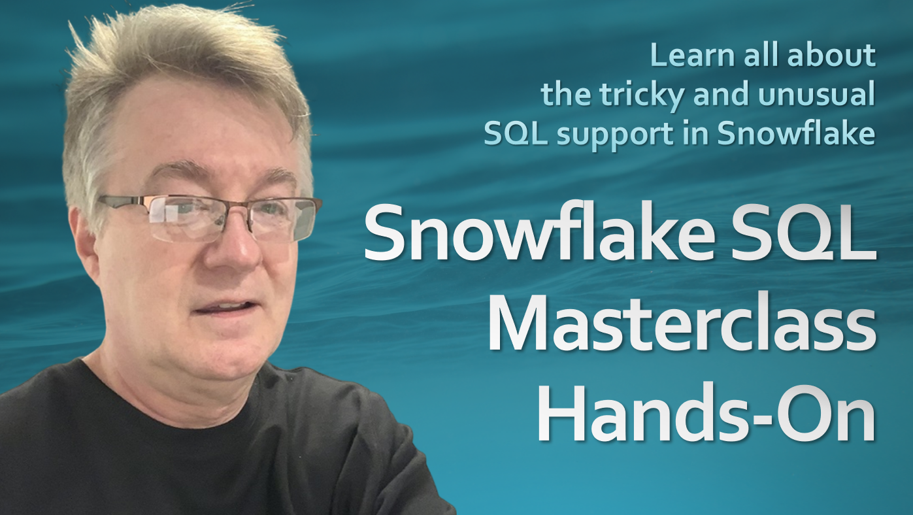

# Snowflake SQL

All demo source code for my Udemy course **Improvements to Snowflake SQL Masterclass Hands-On**.

To use this repo with my course, you can clone it and open it locally with VS Code. Then, for each lecture, locate the demo files by looking at the section and the specific SQL file. Copy and paste that file in a SQL worksheet in Snowsight, rather then running it from within VS Code.

I used number prefixes to make it easier to locate both the section and the lecture.

# Sections

1. **Simplified Queries**
* Create a Free Snowflake Trial Account
* Simplified Snowflake SQL
* Simplified Joins
* Reused Expressions
* Table Functions
* TABLE vs LATERAL
* Include/Exclude Groups of Columns

2. **Filters and Joins**
* Limiting Data in SQL
* Filter Window Functions with QUALIFY
* Case Insensitive Queries
* Regular Expressions
* Patterns with Match Recognize
* Full-Text SEARCH
* Sort with NULLS FIRST/LAST

3. **Joins**
* Common Join Types
* LATERAL Joins
* “Exploding” Joins
* ASOF Joins
* Fuzzy Matching
* Directed Joins

4. **Aggregates**
* COUNT_IF Function
* Pivot Data
* Unpivot Data
* ANY_VALUE Function
* MIN_BY and MAX_BY Functions
* Count Distinct Values

5. **Persisting Data**
* Permanent Tables
* Table Constraints
* Hybrid Tables with Indexes
* Multi-Table INSERT
* Bulk File Upload with Schema Inference
* Changing Persisted Data

6. **Generating Data**
* Synthetic Data Generation
* Sequences and Identity Columns
* SAMPLE Data Extraction
* Generate Similar Table Data
* Time Travel and Fail Safe
* Zero-Copy Cloning

7. **Subqueries and CTEs**
* Uncorrelated and Correlated Subqueries
* Subquery Operators
* Common Table Expressions (CTEs)
* Subqueries to CTEs
* Pipe Operator (->>)
* Set Operators
* Union BY NAME
* Similarity Between Sets

8. **Grouping Data**
* Duplicate and Distinct Values
* MIN_BY and MAX_BY with Duplicates
* Grouping Sets
* OVER and WINDOW Clauses
* Ranking Window Functions
* Offset Window Functions
* Window Function Frames

9. **Tabular Hierarchical Data**
* Hierarchies from Tabular Metadata
* Fixed-Depth Data Hierarchies
* Variable-Depth Data Hierarchies
* CONNECT_BY Recursive Queries
* Recursive CTEs and Views
* Role Hierarchy with Recursive Queries
* Nested Transactions

10. **Semi-Structured Data**
* Array Aggregations
* Object Dictionaries
* FLATTEN Arrays
* Expand Array Operator (**)
* Parse JSON Hierarchies
* Higher-Order Functions
* String Lists vs Arrays
* Geography and Geometry Data Types
* Parsing XML Data

11. **Procedures and Functions**
* Sessions and SQL Worksheets
* Stored Procedures and UDFs
* Python Worksheets
* Vectorized Python UDFs
* User-Defined Table Functions (UDTFs)
* User-Defined Aggregate Functions (UDAFs)

12. **ETL/ELT Pipelines	33**
* Manual CDC (Change Data Capture)
* SELECT CHANGES Clause
* MERGE with Streams and Tasks
* MERGE with ALL BY NAME
* Dynamic Tables
* Immutability Constraints

13. **Snowflake Scripting**
* Snowflake Scripting Blocks
* Conditional and Ternary Logic
* LEAST and GREATEST Functions
* Cursor and ResultSet

14. **SQL for Machine Learning**
* Statistics for Modern Data Science
* Classes in Object-Oriented SQL
* ML Data Preparation
* ML Classification
* ML Forecasting
* ML Anomaly Detection
* ML Contribution Explorer

15. **Snowflake Cortex Functions**
* Snowflake Cortex LLM Functions
* Snowflake Cortex AISQL Functions
* Query Generation with Snowflake Copilot
* Query Generation with Cortex Analyst
* Vector Embeddings

